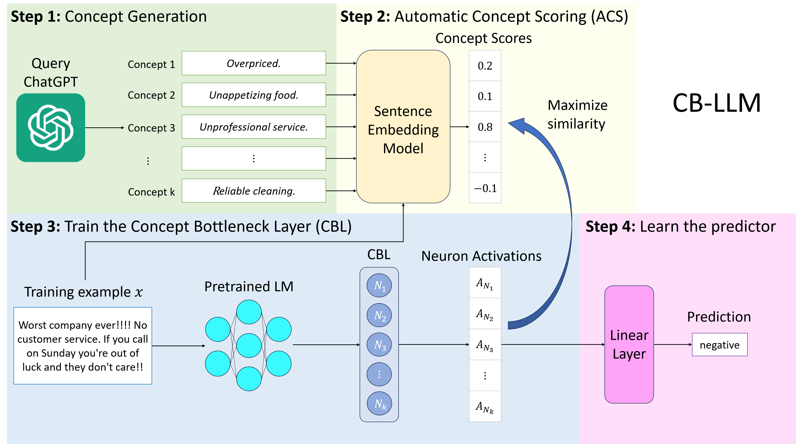

# Crafting Large Language Models for Enhanced Interpretability
**[Update: 12/12/2024]** 
* The preliminary work in this repo only focused on building interpretable LLMs for text-classification task. We have recently generalized and expanded the scope of this preliminary work further to the text-generation task, an essential capabilitiy for modern LLMs.
* Please see our new paper [**Concept Bottleneck Large Language Models**](https://arxiv.org/pdf/2412.07992) and [**new github repo**](https://github.com/Trustworthy-ML-Lab/CB-LLMs) on how to design interpretable LLMs with concept bottlenecks for both text generation and text classification tasks.   

---
This is the repo for the paper: [**Crafting Large Language Models for Enhanced Interpretability**](https://arxiv.org/abs/2407.04307). We proposed Concept Bottleneck Large Language Model (CB-LLM), a pioneering approach to creating inherently interpretable Large Language Models (LLMs). CB-LLM sets a new standard with its high accuracy, scalability, and ability to provide clear, accurate explanations.

<p align="center">
  
</p>

## Setup
Recommend using cuda12.1, python3.10, pytorch2.2.

Install the packages:
```
pip install -r requirements.txt
```

## Training
### Automatic Concept Scoring (ACS)
To generate the concept scores by our ACS strategy, run
```
python get_concept_labels.py
```
This will generate the concept scores for the SST2 dataset using our predefined concept set, and store the scores under `mpnet_acs/SetFit_sst2/`.
Set the argument `--dataset yelp_polarity`, `--dataset ag_news`, or `--dataset dbpedia_14` to switch the dataset.
### Train CBL
To train the CBL, run
```
python train_CBL.py --automatic_concept_correction
```
This will train the CBL with Automatic Concept Correction for the SST2 dataset, and store the model under `mpnet_acs/SetFit_sst2/roberta_cbm/`.
To disable Automatic Concept Correction, remove the given argument.
Set the argument `--backbone gpt2` to switch the backbone from roberta to gpt2.
Set the argument `--dataset yelp_polarity`, `--dataset ag_news`, or `--dataset dbpedia_14` to switch the dataset.
### Train the final predictor
To train the final predictor, run
```
python train_FL.py --cbl_path mpnet_acs/SetFit_sst2/roberta_cbm/cbl_acc.pt
```
This will train the linear predictor of the CBL for the SST2 dataset, and store the linear layer in the same directory.
Please change the argument `--cbl_path` accordingly if using other settings.
### Train the baseline black-box model
To train the baseline standard black-box model, run
```
python finetune_black_box.py
```
This will train the black-box (non-interpretable) model for the SST2 dataset, and store the model under `baseline_models/roberta/`.
Set the argument `--backbone gpt2` to switch the backbone from roberta to gpt2.
Set the argument `--dataset yelp_polarity`, `--dataset ag_news`, or `--dataset dbpedia_14` to switch the dataset.
## Testing
### Test CB-LLM
To test the accuracy of the CB-LLM, run
```
python test_CBLLM.py --cbl_path mpnet_acs/SetFit_sst2/roberta_cbm/cbl_acc.pt
```
Please change the argument `--cbl_path` accordingly if using other settings.
### Generate explanations from CB-LLM
To visualize the neurons in CB-LLM (task 1 in our paper), run
```
python print_concept_activations.py --cbl_path mpnet_acs/SetFit_sst2/roberta_cbm/cbl_acc.pt
```
This will generate 5 most related samples for each neuron explanation.
Please change the argument `--cbl_path` accordingly if using other settings.

To get the explanations provided by CB-LLM (task 2 in our paper), run
```
python print_concept_contributions.py --cbl_path mpnet_acs/SetFit_sst2/roberta_cbm/cbl_acc.pt
```
This will generate 5 explanations for each sample in the dataset.
Please change the argument `--cbl_path` accordingly if using other settings.
### Test the baseline black-box model
To test the accuracy of the baseline standard black-box model, run
```
python test_black_box.py --model_path baseline_models/roberta/backbone_finetuned_sst2.pt
```
Set the argument `--dataset yelp_polarity`, `--dataset ag_news`, or `--dataset dbpedia_14` to switch the dataset.
Please change the argument `--model_path` accordingly if using other settings.
## Cite this work
Chung-En Sun, Tuomas Oikarinen, Tsui-Wei Weng. "Crafting Large Language Models for Enhanced Interpretability". arXiv preprint, 2024
```
@article{cbllm,
   title={Crafting Large Language Models for Enhanced Interpretability},
   author={Chung-En Sun, Tuomas Oikarinen, Tsui-Wei Weng},
   journal={ICML MI Workshop 2024},
   year={2024}
}
```
